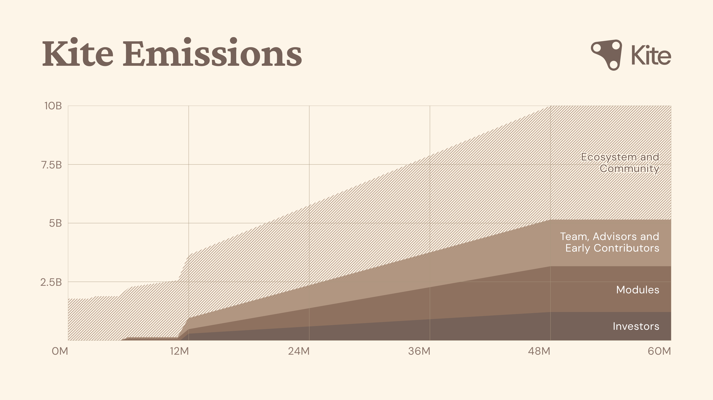

# Tokenomics

### The Mission of Kite AI

Kite AI is building the first blockchain for agentic payments, a foundational platform where autonomous AI agents can operate with verifiable identity, programmable governance, and seamless payments. The company's purpose-built Layer-1 blockchain and Agent Passport system enable AI agents to function as first-class economic actors, creating emergent capabilities through composable interactions. Founded by AI and data infrastructure veterans from Databricks, Uber, and UC Berkeley, Kite AI has raised $33 million from top-tier investors, including PayPal, General Catalyst,Coinbase Venture and leading blockchain foundations.

### Kite AI Network Overview

The Kite AI blockchain is a Proof‑of‑Stake (PoS) EVM‑compatible Layer‑1 chain that serves as a low‑cost, real‑time payment mechanism and coordination layer necessary for autonomous agents to interoperate. Alongside the L1 are a suite of modules, modular ecosystems that expose curated AI services (e.g., data, models, and agents) to users. Modules operate as semi‑independent communities that interact with the L1 for settlement and attribution, while providing specialized environments tailored to particular verticals. Together, the L1 and Modules form a tightly coupled ecosystem where users may assume distinct roles, module owners, validators, or delegators, and the native token KITE drives incentives, staking, and governance.

### KITE Token Utilities

The utility of the KITE token will be rolled out in two phases: Phase 1 utilities are introduced at the time of token generation so that early adopters can immediately participate in the Kite network, while Phase 2 utilities will be added with the launch of the Mainnet.&#x20;

### Phase 1 Utilities

**Module Liquidity Requirements -** Module owners who have their own tokens must lock KITE into permanent liquidity pools paired with their module tokens to activate their modules. This requirement scales with module size and usage, creating deep liquidity while removing tokens from circulation. Liquidity positions are non-withdrawable while modules remain active, ensuring long-term token commitment from the most value-generating participants.

**Ecosystem Access & Eligibility -** Builders and AI service providers must hold KITE to be eligible to integrate into the Kite ecosystem. This gives the KITE token immediate utility as an access token to participate in the agentic payment ecosystem and aligns the interests of businesses and builders with that of the Kite network as a whole.

**Ecosystem Incentives -** A portion of the KITE supply will be distributed to users and businesses who bring value to the Kite ecosystem.

### Phase 2 Utilities

**AI Service Commissions -** The protocol collects a small commission from each AI service transaction and can swap it for KITE on the open market before distributing it to the module and the Kite L1. This ensures that service operators receive payment in their currency of choice while the module and L1 can receive native tokens that increase their stake and influence within the ecosystem. Protocol margins are converted from stablecoin revenues into KITE, creating continuous buy pressure tied directly to real AI service usage and revenues, ensuring token value scales with network adoption.

**Staking -** Staking KITE secures the network and grants users eligibility to perform services in exchange for rewards. Module owners develop, operate, and manage a module on the Kite network, validators participate in a Proof-of-Stake consensus, and delegators stake tokens to secure and support modules they find value in.

**Governance -** Token holders vote on protocol upgrades, incentive structures, and module performance requirements, aligning the interests of stakeholders with long‑term network health.

### Modules, Validators, and Delegators

Kite validators secure the network by staking tokens and participating in consensus. Each validator selects a specific module to stake to so that incentives are aligned with that module’s performance. Core responsibilities include maintaining network security and consensus stability, participating in governance and voting, and advancing community collaboration and ecosystem growth.

Kite delegators stake tokens to secure the network. Each delegator must select a specific module to stake on, aligning their incentives with that module’s performance. Delegators are expected to take part in ecosystem governance and engage with the community.

Modules, validators, and delegators receive token emissions through a novel continuous reward system designed to incentivize long-term holding. Participants accumulate KITE rewards over time in a "piggy bank"—they can claim and sell their accumulated tokens at any point, but doing so permanently voids all future emissions to that address. The mechanism transforms token recipients into long-term aligned stakeholders who must weigh immediate liquidity against ongoing value accrual.

### Initial KITE Allocation

The total supply of KITE is capped at 10 billion and distributed as follows.

<figure><figcaption></figcaption></figure>

**Ecosystem and Community (48%) -** Ecosystem and community tokens are dedicated to accelerating user adoption, builder and developer engagement, and ecosystem liquidity. They will fund community airdrops, liquidity programs, and growth initiatives that expand participation, reward meaningful contributions, and drive Kite’s transition from launch to broad utility.

**Investors (12%) -** Investor tokens are distributed under structured vesting schedules to align investor interests with the network's long-term growth, ensuring that early financial supporters remain committed as the ecosystem expands.

**Modules (20%) -** Tokens allocated to modules will be used to incentivize the development of high-quality AI services and to expand the infrastructure that enables users to interact seamlessly with the Kite ecosystem. These funds will support developer grants, performance-based rewards, and the build-out of services that enhance both the intelligence and accessibility of the network.

**Team, Advisors, and Early Contributors (20%) -** Team and advisor tokens align the long-term incentives of Kite's builders with the network's sustained success. These allocations reward early contributors, developers, and strategic advisors who are building and scaling the network, with multi-year vesting schedules that promote stability and accountability as the ecosystem matures.

<figure><figcaption></figcaption></figure>

### The Kite Network Value Capture

**Revenue-Driven Network Growth -** Kite AI implements multiple mechanisms that directly tie token value to network revenues and usage. A percentage of fees from AI service transactions are collected as commission for modules and the network. This ensures the token can benefit directly from every transaction on the network. As modules grow and generate more revenue, additional KITE is locked into their liquidity pools.&#x20;

**Non-Inflationary Economics -** Unlike traditional PoS networks that rely on perpetual token inflation, KITE transitions rapidly from emissions-based rewards to a sustainable model powered entirely by protocol revenues. Initial emissions from a dedicated reward pool bootstrap early network participation, but the system is designed to transition to revenue-driven rewards funded by real AI service usage. This ensures token holders are never diluted by inflation–instead, rewards come directly from value created within the ecosystem.

Together, these mechanisms create a tokenomic system where real AI demand directly drives token value through multiple reinforcing loops: service usage generates revenues, successful modules lock more liquidity, and high-value participants are incentivized to continue creating value capture for the Kite network. The result is a token whose value is fundamentally linked to the utility and adoption of the Kite AI network.\
