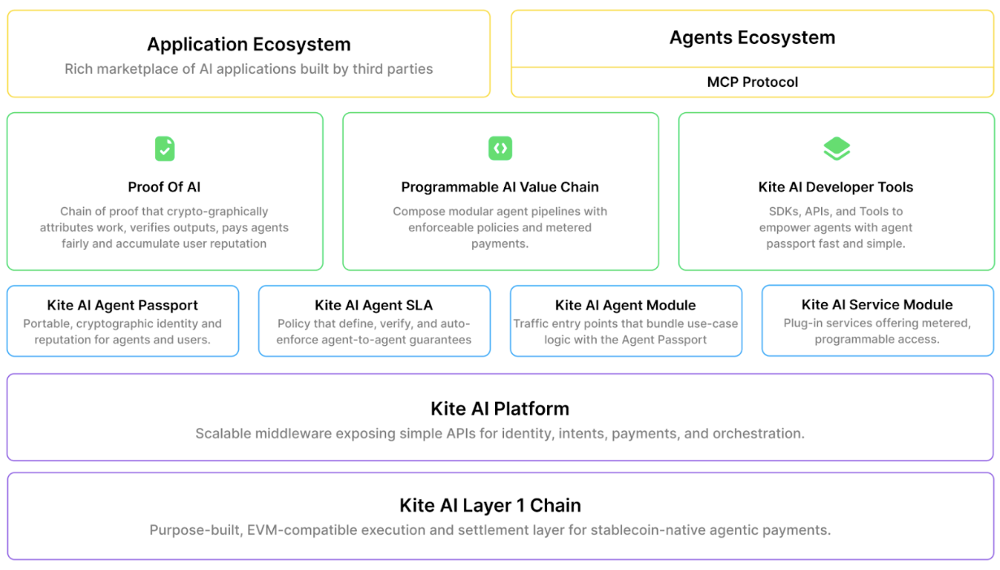

# Architecture & Design Pillars

Kite is built from first principles for autonomous agents, not adapted from human-centric systems. Every architectural decision optimizes for one goal: enabling agents to operate with mathematical safety guarantees.

## The Agentic Infrastructure Revolution

AI agents have reached an inflection point. They analyze markets in milliseconds, optimize supply chains across continents, and execute strategies with precision surpassing human capabilities. McKinsey projects autonomous agents will generate $4.4 trillion in annual value by 2030.

Yet a striking paradox emerges: **infrastructure, not intelligence, has become the bottleneck**. Agents trusted with critical decisions cannot cryptographically prove they're operating within defined constraints. Users face an impossible choice: grant unconditional trust and risk everything, or manually authorize each transaction and destroy the very autonomy that makes agents valuable.

Three converging forces make an infrastructure revolution urgent:
1. **Model Readiness**: Language models now reliably execute complex multi-step plans with production-grade consistency
2. **Enterprise Demand**: Companies need agents with real authority but cannot risk catastrophic losses
3. **Regulatory Reality**: Frameworks like the EU AI Act demand algorithmic accountability with cryptographic proof

The models are ready. The businesses are desperate. The regulators are watching. With Kite, the infrastructure revolution begins.

## Why Human-Centric Infrastructure Fails Agents

### The Authentication Paradox
Contemporary digital services assume the entity requesting access is human. This creates insurmountable problems for AI agents:

**Credential Management Crisis**: A single organization deploying 50 agents across 20 services must manage 1,000 unique credential relationships. Long-lived API keys possess dangerously broad permissions. When compromised, these keys grant attackers persistent access.

**Identity Verification Impossibility**: No service can definitively verify that "Alice's trading agent" genuinely belongs to Alice. Current mechanisms cannot distinguish between legitimate agents, compromised agents, or malicious actors claiming the same principal.

**OAuth Fails for Autonomous Agents**: Traditional authorization makes decisions once and then goes blind. After an agent receives an OAuth token, the system cannot answer: Has the agent's behavior changed suggesting compromise? Will this action trigger expensive operations? Has cumulative cost exceeded bounds?

### The Payment Infrastructure Mismatch
Traditional payment systems make agent operations financially prohibitive:

**Economic Impossibility**: Credit card processing incurs fixed costs ($0.30) plus percentage fees (2.9%). A penny transaction costs over thirty cents to process. International transfers cost $15-50 regardless of amount with multi-day delays.

**Absence of Programmable Money**: Agents require streaming payments, conditional releases, automatic splits, and escrow with triggers. Current systems require fragile towers of webhooks, databases, and reconciliation scripts.

### The Trust and Programmability Void
The most fundamental limitation: absence of verifiable, programmable trust.

**Unverifiable Constraint Enforcement**: An investment agent might claim to enforce a 5% daily loss limit but could easily violate this without detection. Users discover breaches only after catastrophic damage.

**Programmable Governance Impossibility**: Today's governance is fragmented across platforms. What's needed is unified, cryptographically enforced rules: "total spend across all agents under $1,000/day" or "any transaction above $100 requires user approval regardless of service."

**Accountability Vacuum**: When agents misbehave, determining responsibility requires manual forensic investigation. Without immutable audit trails and cryptographic proof, resolution depends on lawyers instead of code.

## Core Design Principles

### 1. Agent-First Architecture
Traditional blockchains assume human users who can manage keys and evaluate risks. Kite breaks this assumption entirely:

- **Hierarchical Identity**: User → Agent → Session with cryptographic delegation
- **Programmable Constraints**: Smart contracts enforce spending limits and operational boundaries that agents cannot exceed
- **Session-Based Security**: Ephemeral keys for individual operations, not permanent credentials
- **Agent Transaction Types**: Embedded API requests within payments, not just value transfers

### 2. Cryptographic Trust Chain
Every action creates verifiable audit trails:
- **No Direct Key Access**: Agents never touch private keys directly
- **Fine-Grained Authorization**: Task-level permissions, not agent-level
- **Reputation Without Identity Leakage**: Shared reputation with independent identity

### 3. Sovereignty Through Separation
- **Decentralized Assets**: Self-custodial wallets with smart contract enforcement
- **Centralized Services**: Platform APIs for developer experience
- **Best of Both**: Security of decentralization + usability of centralization

### 4. Native Protocol Compatibility
Rather than creating another isolated protocol, Kite embraces existing standards as first principles:

- **A2A Protocol**: Direct agent coordination across platforms
- **Agent Payment Protocol (AP2)**: Kite executes AP2 intents with on-chain enforcement
- **MCP**: Model interoperability across the entire LLM ecosystem
- **OAuth 2.1**: Backward compatibility with existing services
- **X402 Standard**: Agent-native payments for future developments

This standards-first approach means developers don't choose between Kite and their existing stack—they add Kite to enhance what already works.

### 5. Mathematical Safety Guarantees
- **Provable Bounds**: Users know exact maximum exposure before authorizing agents
- **Cryptographic Enforcement**: Constraints cannot be violated even with total agent compromise
- **Automatic Expiration**: All authorizations include time-based revocation
- **Defense in Depth**: Multiple security layers with graduated impact

### 6. Economic Viability for Micropayments
- **Sub-cent Transactions**: Enable per-message, per-token, per-request pricing
- **Predictable Costs**: Stablecoin fees eliminate gas token volatility
- **Instant Settlement**: Real-time value transfer without waiting periods
- **Global Interoperability**: Borderless payments without currency conversion

## Architecture Overview

### Four-Layer Architecture

Kite implements a four-layer architecture that separates concerns while maintaining security and performance:



### Base Layer: EVM-Compatible L1
Optimized specifically for agent transaction patterns:
- **Stablecoin-native fees**: Predictable costs in USDC/pyUSD, eliminating gas token volatility
- **State channels for micropayments**: $0.000001 per message with instant settlement
- **Dedicated payment lanes**: Isolated blockspace preventing congestion
- **Agent transaction types**: Not just payments, but computation requests and API calls embedded in transactions

### Platform Layer: Agent-Ready APIs
Abstracts blockchain complexity for developers:
- **Identity management**: Hierarchical wallets with BIP-32 derivation
- **Authorization APIs**: Session key generation and management
- **Payment processing**: State channel opening, signing, and settlement
- **SLA enforcement**: Automatic penalty and reward execution

### Programmable Trust Layer
Novel primitives that enable trustless agent operations:
- **Kite Passport**: Cryptographic agent IDs with selective disclosure
- **Agent SLAs**: Smart contract interaction templates with enforced guarantees
- **Protocol bridges**: Compatibility with A2A, MCP, OAuth 2.1, and AP2
- **Reputation system**: Verifiable behavioral history portable across services

### Ecosystem Layer
Two interconnected marketplaces:
- **Application marketplace**: AI services registered once, discoverable by millions of agents
- **Agent ecosystem**: Agents coordinate through standard protocols
- **Service discovery**: Cryptographic capability attestations enable trustless matching
- **Reputation networks**: Global trust scores based on verifiable performance

*For detailed architectural components and terminology, see [Core Concepts & Terminology](core-concepts-and-terminology.md)*

## The SPACE Framework

Kite introduces the SPACE framework as the complete end-to-end solution:

**S**tablecoin-native: Every transaction settles in stablecoins with predictable sub-cent fees
**P**rogrammable constraints: Spending rules enforced cryptographically, not through trust
**A**gent-first authentication: Hierarchical wallets with cryptographic principal binding
**C**ompliance-ready: Immutable audit trails with privacy-preserving selective disclosure
**E**conomically viable micropayments: True pay-per-request economics at global scale

## Three Core Innovations

### 1. Three-Layer Identity Architecture
Kite introduces the first hierarchical identity model separating user, agent, and session identities:

**User (Root Authority)**: Private keys in local enclaves, never exposed. Users can instantly revoke all delegated permissions and set global constraints cascading through all agents.

**Agent (Delegated Authority)**: Each agent receives its own deterministic address derived from the user's wallet using BIP-32. Compromising an agent remains bounded by user-imposed constraints. Reputation flows globally across the system.

**Session (Ephemeral Authority)**: Completely random session keys expire after use. Compromising a session affects only one delegation. This defense-in-depth architecture ensures graduated security at every level.

While funds remain compartmentalized for security, reputation flows globally. Every transaction contributes to a unified reputation score, establishing a cryptographic root of trust spanning users, agents, and services.

### 2. Programmable Governance Beyond Smart Contracts
While smart contracts enable programmable money, agents require compositional rules spanning multiple services.

**Unified Smart Contract Account Model**: Users own a single on-chain account holding shared funds. Multiple verified agents operate through session keys with cryptographically enforced spending rules: "ChatGPT limit $10,000/month, Cursor limit $2,000/month, other agents limit $500/month."

**Rules Can Be**:
- **Temporal**: Increase limits over time
- **Conditional**: Reduce limits if volatility spikes
- **Hierarchical**: Cascade through delegation levels

These aren't policies—they're programmatically enforced boundaries that compile to blockchain execution.

### 3. Agent-Native Payment Rails with State Channels
Beyond stablecoins and payments-first blockchains, Kite creates agent-first transaction types.

**Programmable Micropayment Channels**: Two on-chain transactions (open and close) enable thousands of off-chain signed updates, achieving sub-100ms latency at $1 per million requests.

**Architectural Inversion**: Instead of authenticate → request → pay → wait → verify, payments settle instantly during agent interaction within the same channel. This treats per-request and streaming micropayments as first-class behaviors with sub-cent precision and instant finality.

**Channel Variants**:
- **Unidirectional**: Flow value from user to merchant (API consumption, data feeds)
- **Bidirectional**: Enable refunds, credits, two-way value exchange
- **Programmable Escrow**: Embed custom logic in state transitions
- **Virtual Channels**: Route value through intermediaries without new contracts
- **Privacy-Preserving**: Only channel opens/closes appear on-chain

## Security Guarantees

### Cryptographic Security Components
Kite achieves unbreakable security through three interlocking cryptographic primitives:

**Standing Intent (SI)**: User's cryptographically signed declaration of what an agent may do. Defines maximum per-transaction, maximum daily aggregate, and expiration timestamp.

**Delegation Token (DT)**: Agent authorization for specific sessions. Links to Standing Intent via hash, scoped to specific operations, with short expiration (typically 60 seconds).

**Session Signature (SS)**: Final cryptographic proof for transaction execution. Contains complete transaction data, nonce for replay prevention, and freshness proof.

Services verify all three signatures before accepting operations. This triple verification makes unauthorized actions cryptographically impossible.

### Provable Security Properties

**Theorem 1: Bounded Loss**
Given Standing Intent SI with capabilities C and duration D, the maximum extractable value MEV under complete agent compromise is:
```
MEV ≤ C.max_daily × D
```

This provides users with precise risk quantification. A user authorizing an agent with $100 daily limit for 30 days knows their maximum exposure is exactly $3,000.

**Theorem 2: Unforgeability**
Without access to the user's private key, an adversary cannot create a valid Standing Intent for unauthorized agents. The cryptographic hardness of ECDSA/EdDSA ensures computational infeasibility of forgery.

**Additional Properties**:
- **Forward Secrecy**: Compromising a session key reveals only that session's operations
- **Principle of Least Privilege**: Authority only flows downward through delegation
- **Automatic Expiration**: All authorizations include expiration timestamps
- **Non-Repudiation**: Cryptographic signatures provide undeniable proof of authorization

### Multi-Layer Revocation
Comprehensive revocation ensures compromised agents cannot continue operating:

- **Immediate Local Revocation**: Broadcast to Kite Hub, propagates to all providers within seconds
- **Cryptographic Revocation**: Signed certificates cached and verified by services
- **Economic Revocation**: Slashing conditions in agent bonds create financial disincentives
- **Graceful Degradation**: System remains effective even under network partition, hub failure, or blockchain congestion

## Stablecoin: The Native Currency for the Agentic Economy

Digital versions of paper currency fail to address fundamental economic and latency barriers facing agents. Agents require native currency that is:
- **Machine-verifiable**: Cryptographically provable without manual review
- **Programmable**: Conditional logic embedded in value transfer
- **Economical**: Fees below one cent enabling per-message pricing
- **Instant**: Real-time settlement with zero chargeback risk
- **Global**: No cross-border friction or currency conversion

Traditional payment systems fail spectacularly. A single credit card transaction traverses issuers, payment networks, tokenization services, acquirers, and banks. Each node adds latency, fees, and failure modes—resulting in high fixed fees, days-long settlement, and 120-day chargeback windows.

**Blockchain-based stablecoins transform this equation**:
- Transaction fees below $0.01
- Instant finality with zero chargeback risk
- Native programmability for conditional and streaming payments
- Global interoperability without cross-border friction

Stablecoins aren't an optimization—they're the fundamental primitive that makes the agentic economy possible.

## Cost and Latency Advantages

### Programmable Micropayment Channels

**Traditional On-Chain Transactions**:
- Cost per payment: $0.10 to $50.00+ (volatile, congestion-dependent)
- Implication: Sub-dollar payments are uneconomical; fees often exceed principal value
- Latency: 2 seconds to several minutes (probabilistic finality)

**Kite Micropayment Channels**:
- On-chain cost: ~$0.01 per channel (open + close)
- Off-chain cost: Effectively $0 per transfer
- Amortized cost: $0.00000001 per payment (for 1M transactions per channel)
- Latency: <100ms (deterministic peer-to-peer finality)

This enables economically viable real-time micropayments and streaming interactions previously unattainable under traditional blockchain economics.

## Beyond Tempo: From Payments-First to Agent-Native

While Tempo represents state-of-the-art in blockchain payment optimization with stablecoin fees and dedicated lanes, it remains fundamentally limited by human-centric design assumptions. Kite delivers agent-native infrastructure:

| Feature | Tempo | Kite |
|---------|-------|------|
| **Identity** | Flat (all actors equal) | Hierarchical (user → agent → session) |
| **Constraints** | Assumes human evaluation | Cryptographic enforcement prevents hallucination losses |
| **Transactions** | Processes payments | Embeds computation, API calls, data queries in transactions |
| **Protocols** | Isolated | Native A2A, MCP, OAuth 2.1, AP2 compatibility |
| **Agent Support** | Payment optimization | Complete agent-native infrastructure |

Tempo improved blockchain payments. Kite created agent-native infrastructure. The difference is fundamental, not incremental.

## Key Innovations Summary

- **Three-Layer Identity**: User → Agent → Session with graduated security and unified reputation
- **Programmable Governance**: Unified account model with cryptographically enforced compositional rules
- **Micropayment Channels**: $0.000001 per message, sub-100ms latency, 5 channel variants
- **Cryptographic Security**: Triple-signature verification (SI/DT/SS) with provable bounded loss
- **Universal Interoperability**: Native compatibility with A2A, AP2, MCP, OAuth 2.1, X402
- **Stablecoin-Native**: Predictable fees, instant settlement, global interoperability

---

*For detailed technical specifications and use cases, see the [Kite Whitepaper](../get-started/whitepaper-references.md)*
*For detailed concepts and terminology, see [Core Concepts & Terminology](core-concepts-and-terminology.md)*
