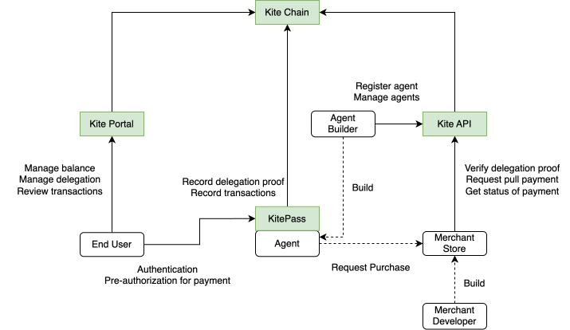
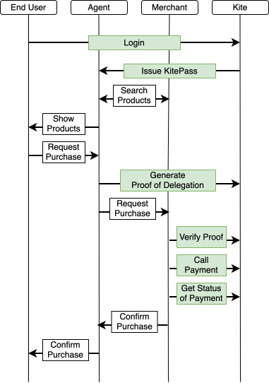

<!-- DEPRECATION-BANNER:START -->

**⚠️ These docs are moving to a new home.** Preview the new site at [docs-preview.gokite.ai](https://docs-preview.gokite.ai). At cutover, this site will redirect there automatically. File issues against [gokite-ai/kite-docs](https://github.com/gokite-ai/kite-docs).

<!-- DEPRECATION-BANNER:END -->

# SDK/API Overview

SDK/API overview of how to integrate with Kite's agentic payment infrastructure.

## 🎯 Target Actors & Authentication

**Kite does NOT store user credentials to manage users' financial resources.** All user authentication flows through trusted third-party OAuth providers.

| Actor | What They Do | How They Authenticate | What They Get |
|-------|--------------|---------------------|---------------|
| **End-users** | Connect wallet/account, approve delegations | **🔐 Third-party OAuth** | Kite Portal + Session Control |
| **AI Agents** | Make payments autonomously | **🔐 MCP + User OAuth** | KitePass + Payment Authorization |
| **Agent Builders** | Register agent IDs, manage agents | **🔐 Developer API key** | Agent Management APIs |
| **Merchants/Payment Providers** | Verify payments, process transactions | **🔐 Proof Verification** | Payment Processing APIs |

### 🚨 Key Security Principles
- **Kite never store user passwords or financial credentials which can control your wallet, users are authenticated through trusted OAuth providers**
- **Kite never hold user funds directly** 
- **Financial operations require cryptographic proof of user consent**

## 🛠️ Integration Components

### **[Agent Builder Guide](api-agent-builder-guide.md)** - Build AI Agents with Payment Capabilities
**What you need to integrate:**
- **MCP Integration** - Connect your agent to Kite's remote MCP server
- **OAuth Integration** - Let users authenticate and configure spending sessions
- **Payment Processing** - Enable autonomous payments through your agent

### **[Merchant Integration](api-merchants-payment-providers.md)** - Accept Agent Payments
**What you need to integrate:**
- **Proof Verification** - Verify delegation proofs before processing payments
- **Payment APIs** - Request and confirm stablecoin transfers
- **Audit Integration** - Access complete transaction history with cryptographic proofs

## 📊 Workflow Diagrams

For a complete overview of how agents and merchants integrate with Kite, see the [Workflow Overview](workflow-overview.md).

