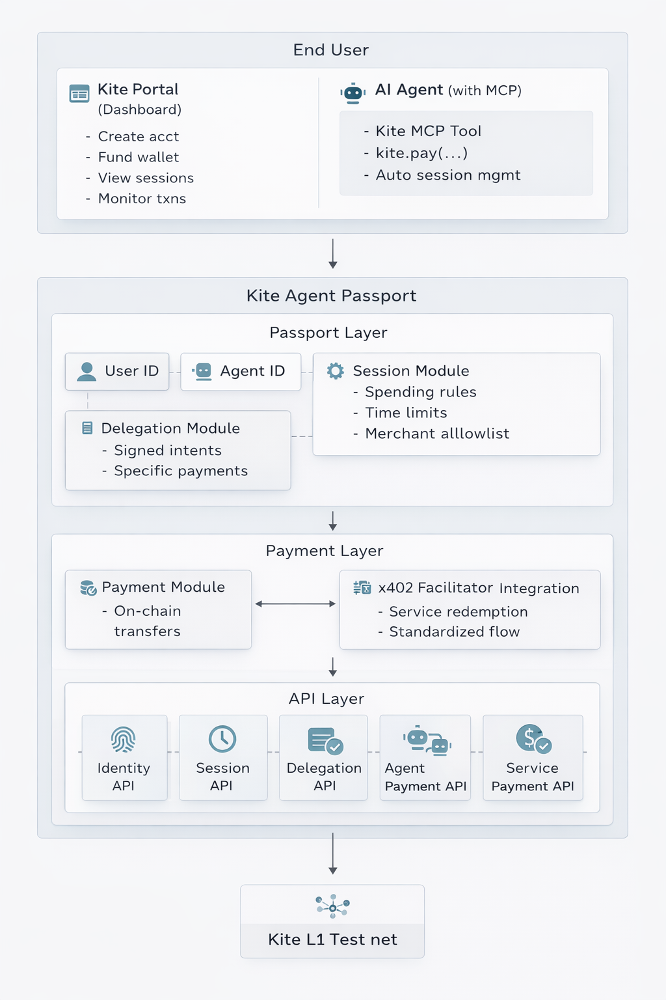

# Kite Agent Passport

Kite Agent Passport is the infrastructure layer that enables autonomous AI agents to make secure, delegated payments on behalf of users. It solves the fundamental problem of how AI agents can transact value in a safe, controlled, and user-approved manner—combining identity, authentication, delegation, and on-chain payment processing in one system.

## The Problem

As AI agents become more capable and autonomous, they need to interact with paid services—from API calls to data retrieval to task completion. Current approaches to agent payments face three fundamental challenges:

- **Scoped payments** — Agents shouldn't have unlimited wallet access. They need permission scoped to specific tasks and spending limits, not blanket authorization to drain funds.
- **Delegated payments** — Agents need autonomy to make payments without requiring human signatures for every transaction, while users maintain control through pre-approved spending rules.
- **Identity-based payments** — Payments must have clear, verifiable identity for both the agent and the user behind it—not anonymous transactions. This enables compliance (AML, KYC), reputation systems, and accountability.

## The Solution

Kite Agent Passport provides a complete infrastructure for agentic payments with three core capabilities:

### 1. Identity and Authentication

Every participant in the system has a verifiable identity:

| Identity Type | Description |
|---------------|-------------|
| **User ID** | Represents the human user who owns the funds |
| **Agent ID** | Represents the AI agent acting on behalf of a user |
| **Service ID** | Represents a service provider that accepts payments |

### 2. Delegated Authority

Users maintain full control through a two-layer delegation system:

- **Sessions** — Master budgets that define overall spending rules: maximum total spend (e.g., $5.00), time limits (e.g., 24 hours), and target merchant restrictions.
- **Delegations** — Specific, signed intents for individual payments: linked to a parent Session, specify exact payment amount and recipient, and require user signature for authorization.

### 3. Secure Payments

On-chain payment processing on Kite L1: all transactions recorded transparently, spending rules enforced automatically, x402 facilitator integration for service providers, and testnet stablecoin for safe experimentation.

## How It Works

The complete payment flow:

1. **User connects agent** — User links their AI agent to Kite via OAuth.
2. **User approves the scope** — User reviews and signs the Session with their preferred rules.
3. **Agent attempts payment** — Agent calls `kite.pay(...)` when it needs to pay for a service.
4. **Session check** — System checks if a valid Session exists for this payment.
5. **Payment execution** — Agent retries the payment, which is now approved.
6. **Service redemption** — Service provider redeems the payment via the Service Payment API.
7. **User monitoring** — User can view all Sessions, Delegations, and transactions in the Portal.

## Key Benefits

### For End Users

- **Controlled spending** — Set clear limits on what your agent can spend.
- **Transparency** — See every transaction your agent makes.
- **Just-in-time approval** — Approve spending rules exactly when your agent needs them.
- **Flexibility** — Adjust or revoke Sessions at any time.

### For Agent Developers

- **Simple integration** — Enable payments with just `kite.pay(...)`.
- **No payment infrastructure** — Don't build identity, auth, or payment systems from scratch.
- **Automatic UX** — The Kite MCP Tool handles pausing, user prompting, and retries.
- **MCP compatible** — Works with any agent framework that supports Model Context Protocol.

### For Service Providers

- **Standardized payments** — Accept agent payments via x402 facilitators.
- **Guaranteed funds** — Payments are pre-authorized and enforceable.
- **Easy integration** — Simple Service Payment API for redemption.
- **New customer segment** — Access the growing market of agentic applications.

## Architecture Overview

| Layer | Purpose |
|-------|---------|
| **Passport** | Identity, auth, and delegation: User/Agent IDs, Sessions (budgets + spending rules), Delegations (signed payment intents). |
| **Payment** | On-chain value transfer on Kite L1, x402 facilitator integration, and service redemption APIs. |
| **MCP Tool** | Integration for AI agents: Kite Payment, session/delegation handling, and user prompts for signatures. |

### Core Concepts

| Concept | Description |
|---------|-------------|
| **Session** | A master budget with spending rules, time limits, and merchant restrictions. Created by user signature. |
| **Delegation** | A specific, signed intent for a payment (or set of payments) linked to a parent Session. |
| **MCP Tool** | The Model Context Protocol integration that gives agents access to Kite payment functionality. |
| **x402** | A payment protocol and facilitator system that enables standardized agent-to-service payments. |
| **Facilitator** | A service that validates payment authorizations and executes on-chain transfers on behalf of services. |

## Quick Start

### For End Users

**Invitation only:** Kite Agent Passport is currently invitation-only during testnet. If you don't have an invitation, you may not be able to complete all steps. See the [Testnet Notice](testnet-notice.md) for details.

1. Use your invitation link to open the [Kite Portal](https://x402-portal-eight.vercel.app/) and configure your account.
2. Connect your wallet and complete signature authentication.
3. On-ramp testnet tokens to your wallet.
4. Create an agent and set its spending rules.
5. Connect the MCP server to your AI client.

### For Service Providers

1. Read the [Service Provider Guide](service-provider-guide.md).
2. Set up your x402 facilitator integration.
3. Configure the Kite Service Payment API.
4. Test payments on the Kite L1 testnet.

### For Developers

1. Start with the [Developer Guide](developer-guide.md).
2. Register your agent ID via the Kite API.
3. Integrate the Kite MCP Tool into your agent framework.
4. Use Kite Payment flow in your agent logic.

## The Kite Vision

Kite Agent Passport is part of the broader Kite mission: **building the agentic internet.** Just as HTTPS and OAuth became foundational infrastructure for the web, Kite Agent Passport provides the foundational infrastructure for agentic commerce and value exchange. As AI agents become primary interfaces for digital interactions, they need secure, standardized ways to transact value—Kite Agent Passport is that infrastructure.

## Next Steps

- **New to Kite?** → [Introduction](introduction.md) (deeper dive)
- **Ready to use it?** → [End User Guide](end-user-guide.md)
- **Integrating as a service or app?** → [Service Provider Guide](service-provider-guide.md) or [Developer Guide](developer-guide.md)
- **Testnet details** → [Testnet Notice](testnet-notice.md)

## Need Help?

- [Testnet Notice](testnet-notice.md) — Status and known issues
- [Kite Portal](https://x402-portal-eight.vercel.app/) — Dashboard and transactions
- [Report an issue](https://github.com/gokite-ai/developer-docs/issues/new/choose) — Bugs or feedback

---

*Part of the Kite blockchain documentation. For Kite's architecture and core concepts, see [Get Started](../get-started/).*
