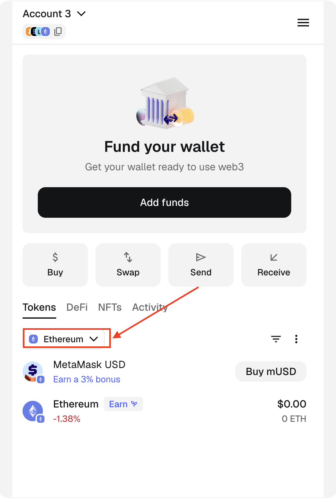
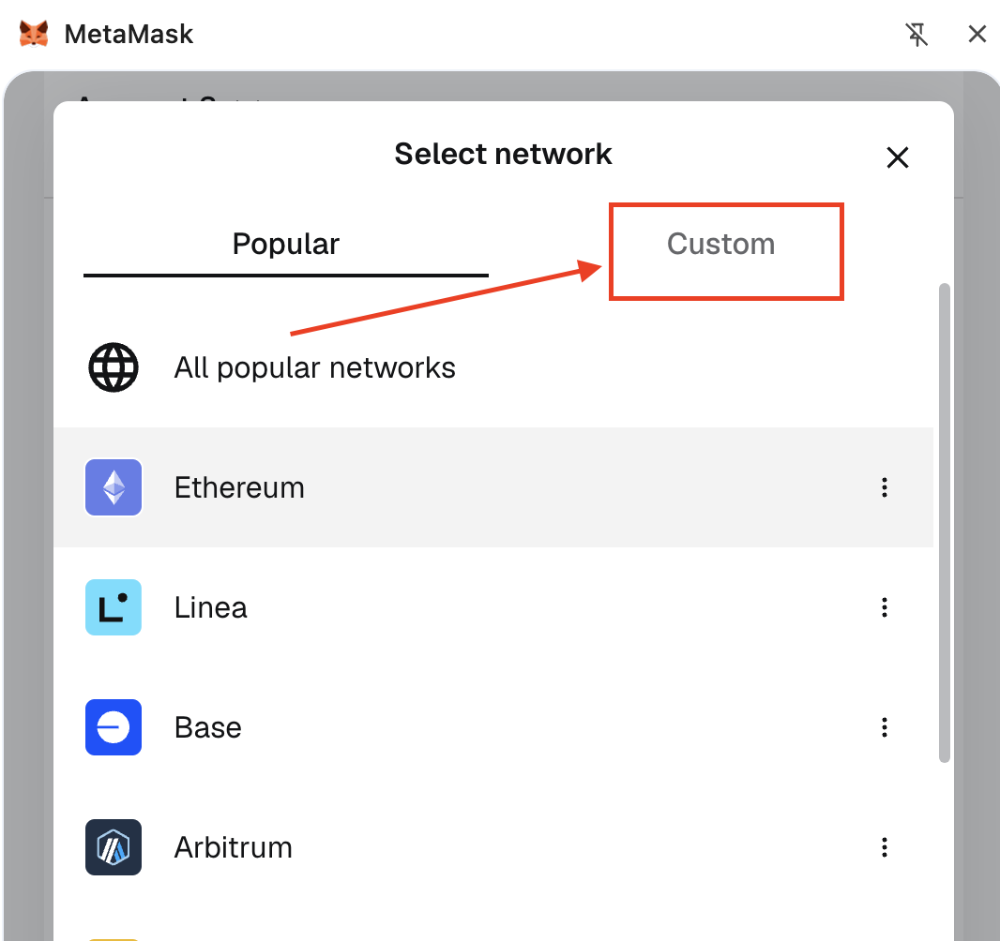
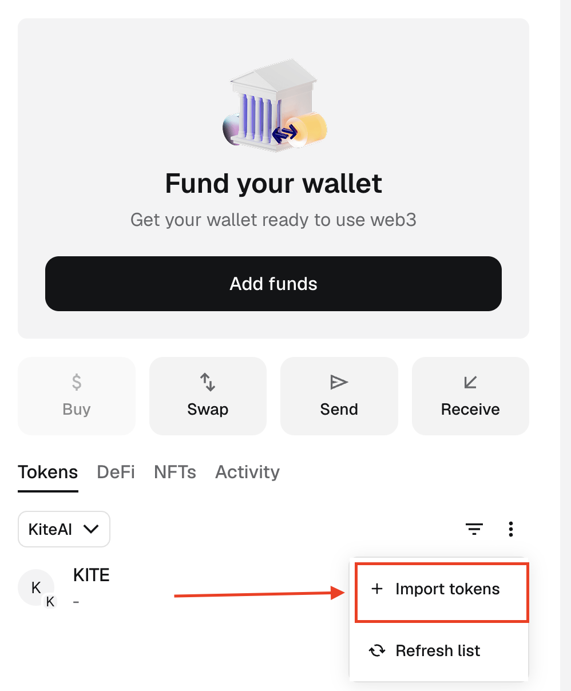

<!-- DEPRECATION-BANNER:START -->
> [!WARNING]
> **This version of the docs is deprecated.** The Kite documentation has moved to [docs.gokite.ai](https://docs.gokite.ai), which now replaces this site. Please use the new docs, and file issues against [gokite-ai/kite-docs](https://github.com/gokite-ai/kite-docs).
<!-- DEPRECATION-BANNER:END -->

# Add Kite Tokens to an External Wallet

If you need to access KITE tokens or USDC.e in your external wallet (e.g., MetaMask), you will need to add Kite Network information to your wallet.

> Note: You will need KITE tokens for gas fees to send tokens on the Kite Network.

## Follow These Steps

1. Open your wallet (MetaMask, Rabby, or any EVM-compatible wallet) and switch networks

<figure><figcaption></figcaption></figure>

2. Navigate to the "Custom" Network section

<figure><figcaption></figcaption></figure>

3. Click **Add custom network** and enter the following details. Once completed, you will see the Kite network and your KITE token balance in your wallet.

| Field | Value |
|---|---|
| **Network Name** | KiteAI |
| **Default RPC URL** | https://rpc.gokite.ai/ |
| **Chain ID** | 2366 |
| **Token** | KITE |
| **Block Explorer URL** | https://kitescan.ai/ |

> For more network information, refer to the [Network Information](../kite-chain/1-getting-started/network-information.md) page.

4. To add USDC.e to your wallet, ensure you're on the Kite Network and click **Import tokens**.

<figure><figcaption></figcaption></figure>

5. Paste the USDC.e token contract address:

```
0x7aB6f3ed87C42eF0aDb67Ed95090f8bF5240149e
```

> Note: The above steps were shown through MetaMask. While the exact steps might be slightly different, this process will work with any EVM-compatible wallet.

### Acquire KITE Tokens

You can get KITE tokens through supported exchanges or bridges. Once acquired, send them to your external wallet address on Kite chain.

---

*Need help? [Open an issue](https://github.com/gokite-ai/developer-docs/issues/new/choose) or contact the Kite team.*
