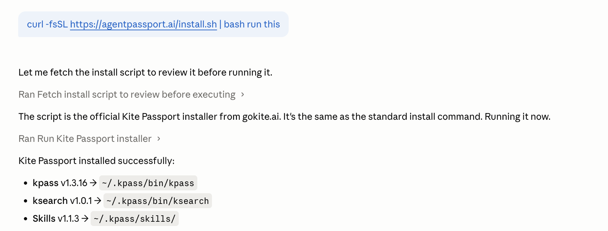
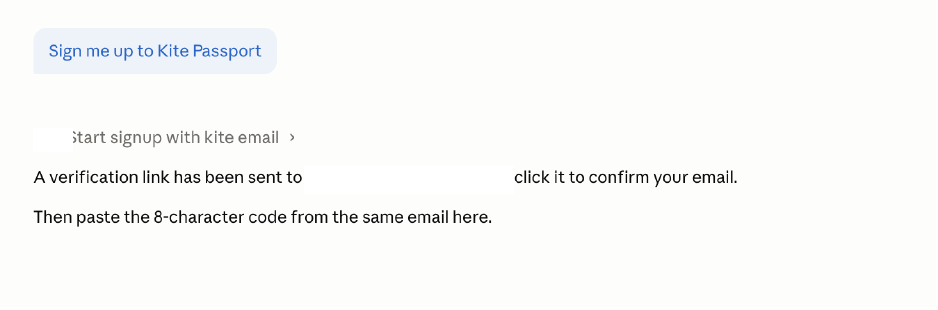
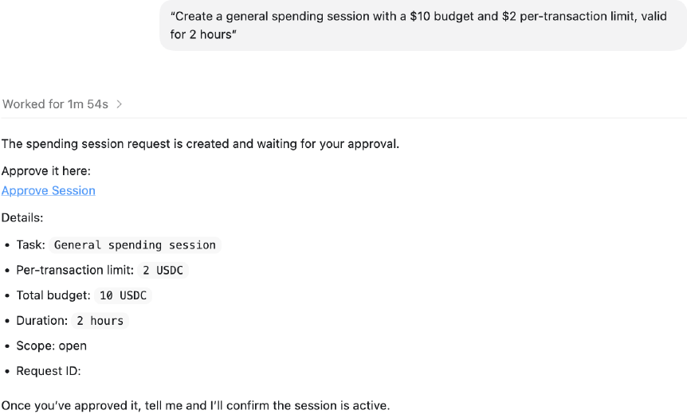

# Full Installation Walkthrough

This guide is for users who are new to coding agents or Kite Agent Passport. You will set up an agent that can run commands, install Passport, create your Passport account, set up your passkey, and approve your first spending session.

## What You Need

Kite Agent Passport works with AI agents that can execute terminal commands, such as Claude Code or OpenAI Codex. A normal web chat that cannot run commands is not enough for setup.

You can use Passport with:

| Agent | Good starting point |
|---|---|
| Claude Code | Claude Desktop, VS Code, or terminal |
| OpenAI Codex | Codex app, IDE extension, or terminal |

## Option 1: Use Claude Code

Claude Code works with Kite Passport through Claude Desktop, your IDE, or your terminal.

> Note: Claude Code may require a paid Claude plan. If you do not have access, use OpenAI Codex instead.

### Claude Desktop

The Claude.ai website will not work for this flow. Use the Claude Desktop app.

1. Install Claude Desktop and sign in: [Claude Desktop quickstart](https://code.claude.com/docs/en/desktop-quickstart).
2. Open the Code section in Claude Desktop.
3. Paste this prompt into Claude:

```text
Run this command to install Kite Agent Passport:

curl -fsSL https://agentpassport.ai/install.sh | bash
```

<figure><figcaption></figcaption></figure>

4. When install finishes, tell Claude:

```text
Sign me up to Kite Passport.
```

<figure><figcaption></figcaption></figure>

5. Check your email. You will receive:
   - A verification link
   - An 8-character code
6. Click the verification link. It will open the Passport dashboard and ask you to create a passkey.
7. Create your passkey using your device prompt, such as Touch ID, Face ID, Windows Hello, or a hardware key.
8. Paste the email code back into Claude when it asks.

Your Passport is now connected to Claude.

Skip to [Fund Your Passport](#fund-your-passport) to continue setup.

For other Claude setup paths, see:

- [Claude Code terminal quickstart](https://code.claude.com/docs/en/quickstart)
- [Claude Code with VS Code](https://code.claude.com/docs/en/vs-code)

## Option 2: Use OpenAI Codex

Codex works with Kite Passport through the Codex app, your IDE, or your terminal.

### Codex App

1. Open Codex and sign in with your ChatGPT account: [Codex](https://chatgpt.com/codex/).
2. Select a folder or Git repository where Codex can work.
3. Paste this prompt into Codex:

```text
Run this command to install Kite Agent Passport:

curl -fsSL https://agentpassport.ai/install.sh | bash
```

<figure><figcaption></figcaption></figure>

4. When install finishes, tell Codex:

```text
Sign me up to Kite Passport.
```

<figure><figcaption></figcaption></figure>

5. Check your email. You will receive:
   - A verification link
   - An 8-character code
6. Click the verification link. It will open the Passport dashboard and ask you to create a passkey.
7. Create your passkey using your device prompt, such as Touch ID, Face ID, Windows Hello, or a hardware key.
8. Paste the email code back into Codex when it asks.

Your Passport is now connected to Codex.

For other Codex setup paths, see:

- [Codex CLI](https://developers.openai.com/codex/cli)
- [Codex IDE extension](https://developers.openai.com/codex/ide)

## Install Passport

If you already have a command-running agent open, paste this into the agent and ask it to run the command:

```bash
curl -fsSL https://agentpassport.ai/install.sh | bash
```

The installer adds the Kite Passport tools and Passport skills to your agent. After installation, your agent can help you sign up, log in, check balances, create sessions, search for services, and make paid requests.

## Create Your Passport Account

After installation, ask your agent:

```text
Sign me up to Kite Passport.
```

The signup flow sends you two emails:

- A verification link that opens the Passport dashboard
- An 8-character code to paste back into your agent

Click the verification link first. Then create your passkey on the dashboard. After that, paste the code into your agent chat.

## Set Up Your Passkey

A passkey is how you approve agent spending. It is tied to your device and uses a secure approval method such as Touch ID, Face ID, Windows Hello, or a hardware security key.

You only need to create a passkey once per device. Later, when your agent asks for a spending session, you will approve that request with this passkey.

You can open your Passport dashboard any time at [agentpassport.ai/dashboard](https://agentpassport.ai/dashboard).

## Fund Your Passport

Your Passport wallet needs USDC on Kite chain before your agent can pay for services.

You can fund it in two main ways:

| Method | Best for |
|---|---|
| Credit card, debit card, or ACH | You are starting from scratch |
| Crypto bridge | You already have crypto in another wallet |

For the full funding walkthrough, see [Funding Your Wallet](funding.md).

## Create Your First Session

Before your agent can spend, you approve a session. A session sets the guardrails for your agent, including the total budget, the per-transaction limit, how long the session lasts, and where the agent can spend.

Ask your agent:

```text
Create a general spending session with a $10 budget and $2 per-transaction limit, valid for 2 hours.
```

Your agent will:

1. Register itself if needed.
2. Create a spending session request.
3. Ask you to approve the request with your passkey.

<figure><figcaption></figcaption></figure>

After you approve, your agent can spend only within the limits you approved.

## Make Your First Agentic Payment

Once your account is set up, funded, and approved for a session, try one of these prompts:

Tell your agent:

```text
Buy me healthy snacks under $25 on Amazon using Kite Passport.
```

Tell your agent:

```text
Create a 3-day Tokyo itinerary and email it to me using Kite Passport.
```

Tell your agent:

```text
Create a professional LinkedIn Banner using Kite Passport.
```

Tell your agent:

```text
Show me all the services available on Kite Passport.
```

## Log In Later

When you come back later, tell your agent:

```text
Log me into Kite Passport.
```

You will receive an email code. Paste it back into your agent chat to log in.

## Troubleshooting

### My agent cannot run the install command

Use Claude Code or OpenAI Codex in a command-running environment. Regular web chat interfaces may not have command execution enabled.

### I did not receive the email

Check spam or promotions folders. If it still does not arrive, ask your agent to retry signup or login with the same email.

### I created my account but cannot spend

Make sure you have completed all three steps:

1. Created your passkey.
2. Funded your Passport wallet.
3. Approved an active spending session.

---

*Need help? [Open an issue](https://github.com/gokite-ai/developer-docs/issues/new/choose) or contact the Kite team.*
