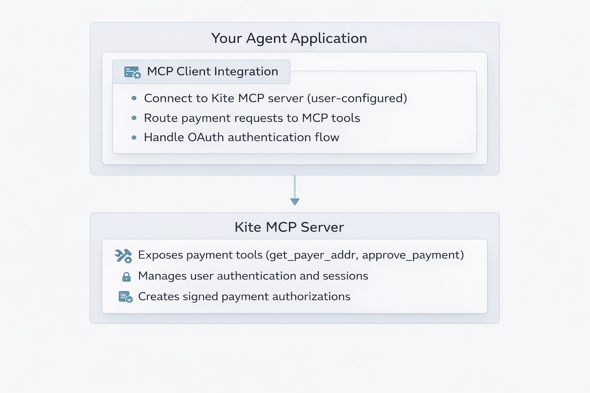

# Developer Guide

This guide is for developers building AI agent applications who want to enable their users to make secure payments through Kite Agent Passport.

## Developer Work Modes

Kite Agent Passport supports three developer work modes, each with different levels of integration:

### Mode 1: Client Agent with MCP (Fully Supported) ✅

You build an AI client application that supports MCP integration. End users register their own Kite Passport accounts and configure them into your application via MCP.

**Integration Path:** MCP (Model Context Protocol) + OAuth

**Sample Agents:** Cursor (IDE), Claude Desktop

---

### Mode 2: Developer as End User (Coming Soon) 🚧

You create a client agent and register your own Kite Passport. Your customers use x402 services **without needing their own Kite Passport**. You pay for services on behalf of customers and charge them through your own billing (e.g., subscription fees).

**Key Point:** This is the only mode where end users do NOT need a Kite Passport. You (the developer) are the sole Kite Passport holder and pay for all customer usage.

**Integration Path:** SDK/API (in development)

**Sample Use Cases:** Aggregator apps, SaaS platforms where you want to bundle service costs into your pricing

---

### Mode 3: Deep Platform Integration (Coming Soon) 🚧

You build a full-featured application that manages the complete Kite Passport lifecycle programmatically for your customers. Unlike Mode 1 where users self-serve through the Portal, you control the entire setup via APIs.

**How It Works:**
1. **Create Client Agent via API** — You programmatically create an agent for the user
2. **Create Session via API** — You set up a session with spending rules via API
3. **Register Session On-Chain via SDK** — The session is registered on the blockchain using a blockchain SDK
4. **Connect to MCP + OAuth** — After setup, users connect via MCP with OAuth authentication
5. **Configuration Complete** — Users can now make payments through your managed infrastructure

**Key Points:**
- End users still need to register their own Kite Passport accounts and maintain wallet balance
- You manage the technical infrastructure (agent creation, session setup, on-chain registration)
- Users benefit from a seamless, configured experience without manual Portal setup
- You don't pay on behalf of users — they control their own funds

**Integration Path:** Complete REST API + Blockchain SDK (in development)

**Sample Use Cases:** Enterprise platforms, white-label agent marketplaces, apps requiring programmatic session management, managed service providers

---

## What You're Building (Mode 1)

As an agent developer building in Mode 1, you are creating an AI application that:

- Supports MCP (Model Context Protocol) connections
- Allows users to configure external MCP servers (like Kite)
- Routes payment requests to MCP tools provided by Kite
- Handles OAuth authentication when connecting MCP servers

**User responsibilities in Mode 1:**
- Register their own Kite Passport account
- Create an Agent in the Kite Portal (self-service UI)
- Configure the MCP connection in your application
- Authorize payment sessions with their own wallet

**Contrast with Mode 3:** In Mode 1, users self-serve through the Kite Portal. In Mode 3, you would programmatically create agents and sessions via APIs, handle on-chain registration via SDK, and provide a more managed experience.

---

## Prerequisites

Before you begin, ensure your application has:

- [ ] MCP client support
- [ ] OAuth handling capability for MCP connections
- [ ] UI for users to add/manage MCP server configurations

---

## How It Works

### Architecture Overview



### User Flow (Mode 1)

1. **Setup Phase:**
   - User visits Kite Portal and creates a Kite Passport
   - User creates an **Agent** in the portal (gets Agent ID)
   - User copies MCP configuration from portal

2. **Configuration Phase:**
   - User adds Kite MCP configuration to your application
   - User authenticates via OAuth when prompted
   - If no session exists, user creates one with spending limits

3. **Payment Phase:**
   - Your agent calls x402 service that requires payment
   - Service returns HTTP 402 Payment Required
   - Your agent calls Kite MCP tools to get payment authorization
   - Payment is executed within user's authorized session

**Note:** This is the Mode 1 (self-serve) flow. In Mode 3, you would handle agent creation, session setup, and on-chain registration via APIs/SDK before the user connects via MCP.

---

## MCP Server Configuration

Users will configure the Kite MCP server in your application with:

```json
{
  "kite-passport-mcp": {
    "url": "https://neo.dev.gokite.ai/v1/mcp"
  }
}
```

**Note:** The MCP URL may include an Agent ID or authentication token, which the user obtains from the Kite Portal.

---

## MCP Tools Reference

The Kite MCP server provides two primary tools for payment operations.

### Tool: `get_payer_addr`

Retrieves the user's Account Abstraction (AA) wallet address.

**Input:** None

**Output:**
| Field | Type | Description |
|-------|------|-------------|
| `payer_addr` | string | User's AA wallet address |

**Example:**
```javascript
const result = await mcpClient.callTool('get_payer_addr', {});
// Returns: { "payer_addr": "0x742d35Cc..." }
```

---

### Tool: `approve_payment`

Creates a signed X-Payment payload for the X402 protocol.

**Input:**

| Parameter | Type | Required | Description |
|-----------|------|----------|-------------|
| `payer_addr` | string | Yes | User's AA wallet address |
| `payee_addr` | string | Yes | Service provider's wallet address |
| `amount` | string | Yes | Payment amount in token units |
| `token_type` | string | Yes | Token identifier (e.g., "USDC") |
| `merchant_name` | string | No | Optional merchant name |

**Output:** Signed payload for the `X-Payment` HTTP header.

**Example:**
```javascript
const result = await mcpClient.callTool('approve_payment', {
  payer_addr: "0x742d35Cc...",
  payee_addr: "0x209693Bc...",
  amount: "100",
  token_type: "USDC"
});

// Returns authorization object with x_payment field for header
```

---

### Complete Payment Flow Example

```javascript
async function callX402Service(serviceUrl, requestData) {
  // 1. Call service (may return 402 Payment Required)
  let response = await fetch(serviceUrl, {
    method: 'POST',
    body: JSON.stringify(requestData)
  });

  // 2. Handle 402 response
  if (response.status === 402) {
    const paymentInfo = await response.json();
    
    // 3. Get payer address
    const payer = await mcpClient.callTool('get_payer_addr', {});
    
    // 4. Approve payment
    const auth = await mcpClient.callTool('approve_payment', {
      payer_addr: payer.payer_addr,
      payee_addr: paymentInfo.payee_addr,
      amount: paymentInfo.amount,
      token_type: paymentInfo.token_type
    });

    // 5. Retry with payment header
    response = await fetch(serviceUrl, {
      method: 'POST',
      headers: { 'X-Payment': auth.x_payment },
      body: JSON.stringify(requestData)
    });
  }

  return await response.json();
}
```

---

## Session Management

### Key Concepts

| Concept | Description |
|---------|-------------|
| **Agent ID** | Unique identifier created in Kite Portal |
| **Session** | Time-bounded authorization with spending limits |
| **OAuth** | Authentication for MCP server connection |

### Session Behavior

- Each agent can have **at most one active session** at a time
- Sessions have budget limits and expiration times
- When a session expires, users must re-authenticate and create a new one
- Users can invalidate sessions from the Kite Portal

### Error Handling

| Error | Cause | Solution |
|-------|-------|----------|
| `session_creation_required` | No valid session exists | User must complete OAuth flow and create session |
| `SessionExpired` | Session time limit reached | Re-authenticate and create new session |
| `InsufficientBudget` | Payment exceeds session limits | Create new session with higher limits |
| `Unauthorized` | OAuth token expired | Re-initiate OAuth flow |

---

## Security Best Practices

1. **Store MCP configurations securely** - Never log API keys or tokens
2. **Validate OAuth state parameter** - Prevent CSRF attacks
3. **Handle session expiration gracefully** - Prompt users to re-authenticate
4. **Don't cache sensitive data** - Payer addresses and auth data should be fetched fresh

---

## Testing Your Integration

### Testnet Setup

1. Create test account at Kite Portal (testnet instance)
2. Get test tokens from faucet
3. Create test agent in portal
4. Configure test MCP in your application

### Test Scenarios

| Scenario | Expected Behavior |
|----------|-------------------|
| First-time connection | OAuth flow → Session creation → Tools available |
| Payment with valid session | Payment executes successfully |
| Payment without session | Error returned, user prompted to authenticate |
| Session expiration | Re-authentication required |

---

## Troubleshooting

| Issue | Solution |
|-------|----------|
| "Agent not found" | Verify Agent ID in Kite Portal |
| "Session creation required" | Complete OAuth flow in your app |
| "Unauthorized" | Re-connect the MCP server |
| "Payment failed" | Verify service supports x402 protocol |

---

## Next Steps

1. Review the [MCP Protocol specification](https://modelcontextprotocol.io/)
2. Set up a test agent in the [Kite Portal](https://x402-portal-eight.vercel.app/)
3. Test the MCP connection and payment flow
4. Review [Service Provider Guide](service-provider-guide.md) to understand the other side

---

## Additional Resources

- **Kite Portal:** https://x402-portal-eight.vercel.app/
- **MCP Protocol:** https://modelcontextprotocol.io/
- **x402 Demo Facilitators:** https://github.com/gokite-ai/x402
- **Testnet Notice:** [testnet-notice.md](testnet-notice.md)

***

*Need help? [Open an issue](https://github.com/gokite-ai/developer-docs/issues/new/choose) or contact the Kite team.*

*Continue to: [End User Guide](end-user-guide.md) | [Service Provider Guide](service-provider-guide.md)*
