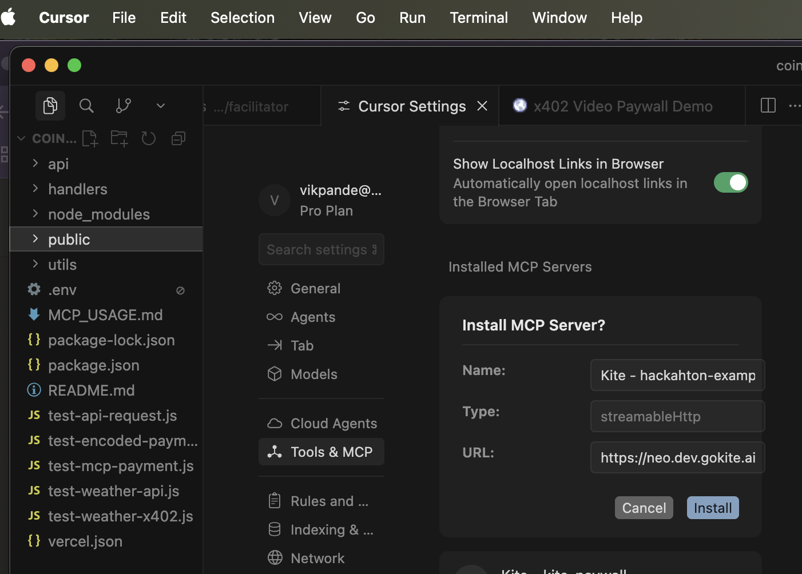
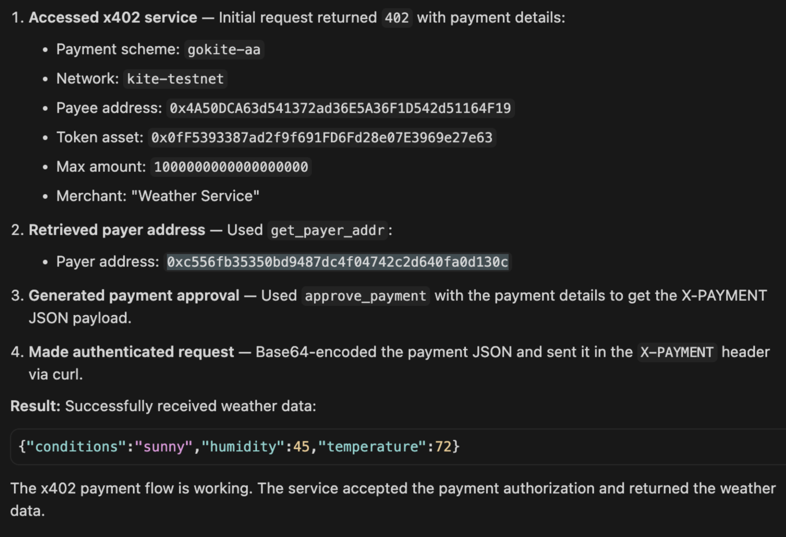
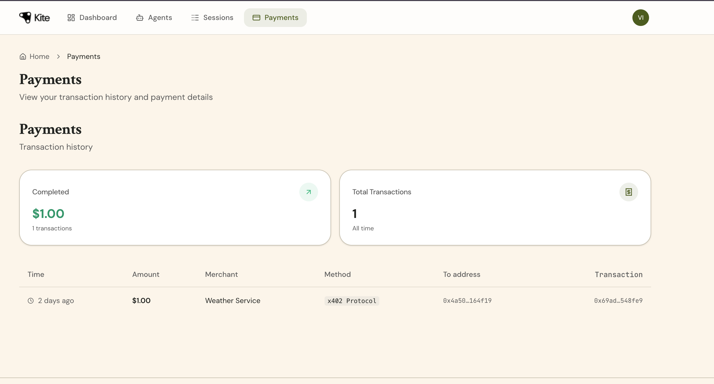
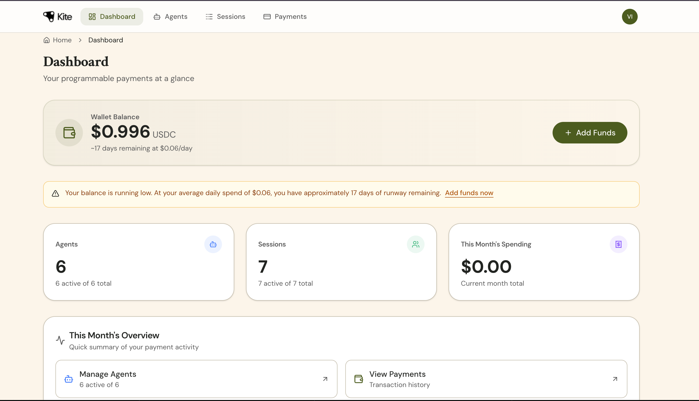

# End User Guide

This guide will walk you through setting up Kite Agent Passport to enable your AI agents to make secure, controlled payments on your behalf.

## What You're Setting Up

By the end of this guide, you will have:
- A Kite account with a secure wallet
- Testnet tokens to experiment with
- An AI agent configured with spending rules
- The ability for your agent to make payments within your defined limits
- Full visibility into all transactions your agent makes

### How It Works with Your AI Client

You're using **Mode 1: Client Agent with MCP** — the most common integration pattern. In this mode:
- You register and manage your own Kite Passport
- You configure the Kite MCP server into an AI client you use like Claude Desktop or Cursor (recommended)
- You control your own wallet and payment authorizations
- The AI agent can make payments on your behalf within the limits you set

This is different from other modes where developers might manage passports for you or pay on your behalf. In this mode, you remain in full control of your funds.


## Step 1: Create Your Kite Account

The Kite Portal is your dashboard for managing your wallet, viewing transactions, and configuring spending rules.

**Important — Invitation only:** Kite Agent Passport is currently available by invitation only during the testnet phase. There is no sign-up; use your invitation link to access the Portal and configure your account. If you have not received an invitation, you may not be able to complete the steps below. See the [Testnet Notice](testnet-notice.md) for more details.

### Navigate to the Portal

Use your **invitation link** to access the Kite Portal (do not look for a sign-up page, follow the invitation link you received):

```
https://x402-portal-eight.vercel.app/
```

### Set Up Your Account

1. Open the invitation link you received
2. You'll be prompted to connect your wallet

### Connect Your Wallet

Kite uses Privy to provide secure, self-custodial wallets.

1. Click **"Connect Wallet"**
2. Input your email address and click **"Continue with Email"**
3. Complete the authentication flow

**Important:** When you connect your wallet, you'll also need to complete a **signature authentication**. This is a security measure that verifies you own the wallet. You'll be prompted to sign a message in your wallet, approve this to continue.

### Your New Wallet

After signing in, a Privy Account Abstraction (AA) wallet is automatically created for you. This wallet:
- Is controlled entirely by you
- Has no funds yet (you'll add testnet tokens next)
- Is unique to your Kite account

---

## Step 2: Add Testnet Tokens

Before your agent can make payments, you need to add testnet tokens to your wallet.

### Open the Faucet

1. In the Portal, locate the **"Add Funds"** or **"Faucet"** button
2. Click to request testnet tokens

### Request Tokens

1. Enter your wallet address (it may be pre-filled)
2. Click **"Request Tokens"**
3. Wait for the transaction to complete
4. Your balance should update within a few seconds

Alternatively, please get in touch with your Kite point fo contact to request for tokens. 

### Verify Your Balance

Return to the Portal dashboard and confirm you now have a testnet token balance. The exact amount will vary, but you should receive enough to experiment with agent payments.

---

## Step 3: Create Your Agent

Now you'll create an AI agent that can make payments on your behalf.

### Navigate to Agent Creation

1. In the Portal, find the **"Agents"** section
2. Click **"Create Agent"**
3. Fill in the fields and click **"Create Agent"**

### Agent-Level Spending Policy

When you create an agent, you can set an **Agent-Level Spending Policy**. This is a high-level limit that applies regardless of individual Session settings.

Example policy settings:
- **Maximum per month:** $200
- **Maximum per transaction:** $50
- **Allowed merchants:** All or specific list


These settings act as an additional safety net beyond the Session-level rules you'll configure later.

## Step 4: Install agent on Cursor


**Note:** Your specific configuration (including authentication) is provided in the Kite Portal when you click "Connect to [Client]".

4. Save the configuration
5. Restart your AI client

**Typical configuration format:**

```json
{
  "kite-passport": {
    "url": "https://neo.dev.gokite.ai/v1/mcp"
  }
}
```




---

## Step 5: Configure Your Session (First Time) 

A Session is a master budget with spending rules. When you first connect your AI client, you'll be prompted to create a Session.

### The Connection Flow

Here's what happens when you connect your AI client to Kite:

1. You add the Kite MCP configuration to your AI client
2. Your AI client connects to the Kite MCP server
3. The system checks for a valid Session
4. If no Session exists, you'll be prompted to create one with spending limits
5. Once created, your agent can make payments within those limits


---

## Step 6: Execute a Test Payment

With your Session in place, your agent can now make payments.

### Make a Test Payment

Use the below prompt on your Cursor's Agent to test the payment flow:

```
As a first step, check whether you can fetch data from https://x402.dev.gokite.ai/api/weather .
This is x402 service, first try accessing it to understand what payment is reqruied. Then use Installed MCP server "kite-mcp" to make payment to get data from the service.
1. access x402 service and understand what payment is necessary
2. call get_payer_addr to know what wallet address you can use
3. call approve_payment to get JSON for X-PAYMENT
4. For x402 X-PAYMENT, wrap the JSON in Base64 use curl command to access x402 again.
```

The agent will:
1. Identify the service and payment required
2. Use the Kite MCP tools **`get_payer_addr`** and **`approve_payment`** to obtain your payer address and a signed payment authorization
3. The payment is validated against your Session rules
4. The payment executes successfully
5. The service delivers the result

**Note:** These two MCP tools (`get_payer_addr` and `approve_payment`) are handled by the agent automatically—you don't need to call them or worry about the details. You only approve Sessions and sign when prompted.



### Monitor the Payment

1. Go to the **Kite Portal**
2. Navigate to **"Payments"** module
3. You should see your test payment with details:
   - Amount paid
   - recipient service
   - Which Session authorized it
   - Timestamp



---

## Understanding Your Dashboard

The Kite Portal gives you full visibility into your agent's activity.

### Wallet Balance

See your current testnet token balance and add more if needed.

### Active Sessions

View all your active Sessions including:
- Remaining budget
- Time remaining
- Which agent uses it
- Which merchants are allowed

### Transaction History

Every payment your agent makes is recorded:
- Amount and recipient
- Which Session authorized it
- Timestamp and transaction hash
- Status (completed/pending/failed)



---


---

## Security Best Practices

### Protect Your Wallet

- Never share your seed phrase or private key
- Use signature authentication every time you connect your wallet
- Review all signature requests carefully before approving

### Review Agent Behavior

- Regularly check your transaction history
- Set Session limits appropriate to the task
- Revoke Sessions you no longer need

### Start Small

- Begin with low Session limits
- Increase limits as you trust your agent
- Use one-time Sessions for unfamiliar tasks

---


## FAQ

### Is my money safe?

Yes. Your agent can only spend within the limits you define in your Sessions. You can revoke access at any time.

### What if my agent tries to overspend?

The payment will be rejected. Your agent will be prompted to request a new Session with your approval.

### Can I have multiple agents?

Yes. Each agent has its own ID and can have its own spending rules.

### What happens when my Session expires?

Your agent will prompt you to create a new Session. Previous payments remain valid.

### Can I reverse a payment?

No, blockchain transactions are final. This is why Sessions allow you to set appropriate limits.

---

## Next Steps

Now that you have Kite Agent Passport set up:

- **Build services:** BUild your own MCP & x402 service and deploy on Kite testnet. 
- **Provide feedback:** Help us improve by sharing your experience
***

*Having trouble? [Report an issue](https://github.com/gokite-ai/developer-docs/issues/new/choose) 

*Continue to: [Service Provider Guide](service-provider-guide.md) | [Developer Guide](developer-guide.md)*
