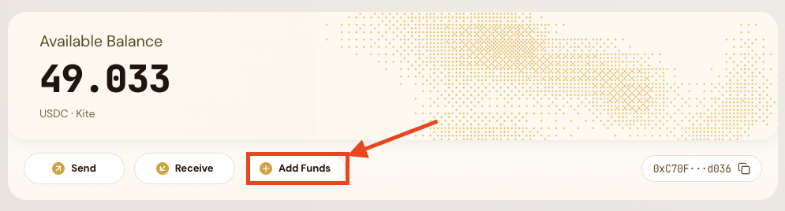
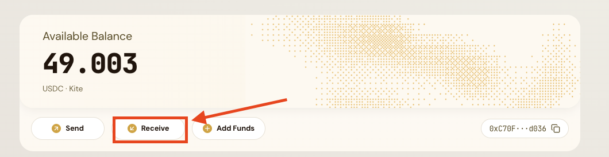
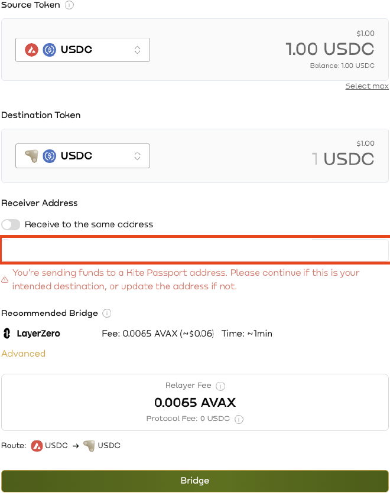
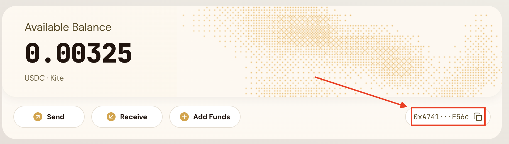
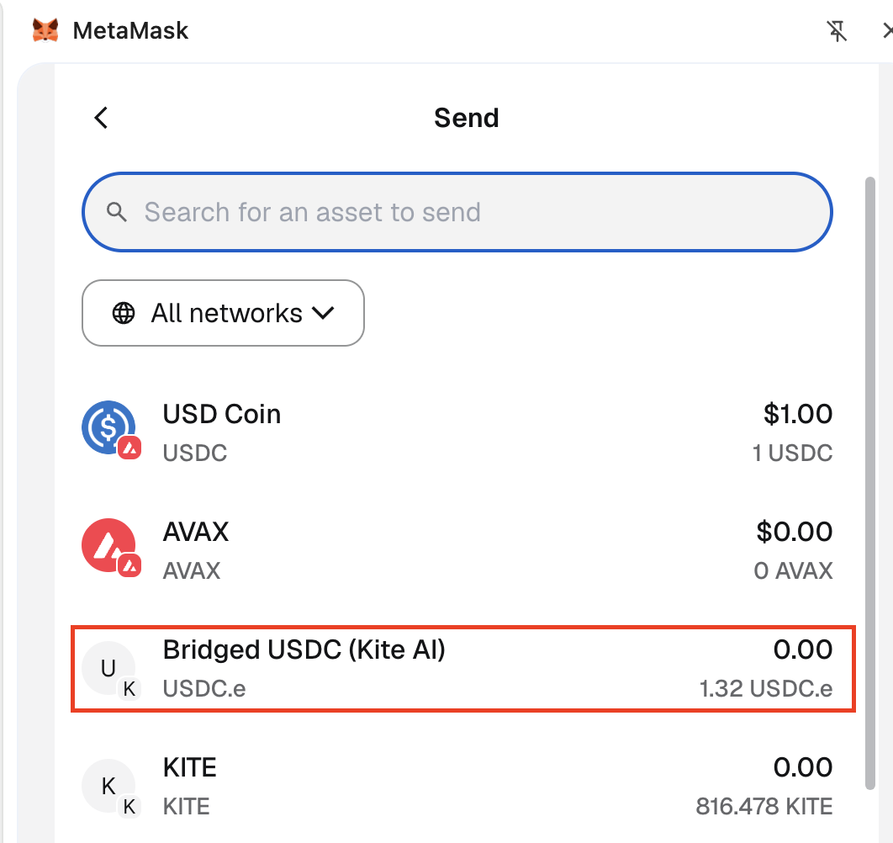

<!-- DEPRECATION-BANNER:START -->

**⚠️ These docs are moving to a new home.** Preview the new site at [docs-preview.gokite.ai](https://docs-preview.gokite.ai). At cutover, this site will redirect there automatically. File issues against [gokite-ai/kite-docs](https://github.com/gokite-ai/kite-docs).

<!-- DEPRECATION-BANNER:END -->

# Funding Your Wallet

To use Kite Agent Passport, you need **USDC on Kite chain** in your Passport wallet. All funding is managed through the **Passport dashboard**.

There are three ways to get funds into your Passport wallet:

| Method | Best for |
|---|---|
| **Buy USDC with fiat** | Starting from scratch — pay with a card or bank account |
| **Bridge directly to Passport** | You already hold tokens on another chain |
| **Bridge to your wallet, then transfer** | You want funds in your own wallet first before moving to Passport |

## Option 1: Fund your Passport with Credit, Debit or ACH

The simplest path if you are starting from zero. Fund your Passport directly using credit, debit, or ACH through our partner Banxa.

> **Note:** This process requires users to verify their ID.

**Steps:**

1. Open the Passport dashboard and click **Add Funds**.

<figure><figcaption></figcaption></figure>

2. Click **Continue to Banxa** — you will be redirected to our on-ramp provider. Your Passport wallet address is filled in automatically.
3. Enter the amount you want to purchase and select your preferred payment method.
4. Follow the steps on Banxa to complete the purchase. If it's your first time, you will be redirected to verify your ID.
5. Once the purchase settles, your balance will update on the Passport dashboard.

> **Note:** Once ordered, Banxa may take some time before fulfilling your request. You can track the status of your order through the link they send to your email.

## Option 2: Bridge Directly to the Passport Wallet

If you already hold tokens on another chain (Ethereum, Base, Arbitrum, etc.), you can bridge them directly into your Passport wallet on Kite chain. The bridge is not limited to stablecoins — you can bridge any token listed on [Kite Bridge](https://bridge.gokite.ai).

**Steps:**

1. Open the Passport dashboard and click the **Receive** button — this opens [Kite Bridge](https://bridge.gokite.ai) with your Passport wallet address pre-filled as the destination.

<figure><figcaption></figcaption></figure>

2. Make note of the Kite Passport wallet address that appears.
3. Connect the wallet that holds your funds.
4. Select the source chain and token.
5. Select Kite as the destination chain.
6. Verify that your Kite Passport wallet address matches the receiver address. It will be pre-filled.

<figure><figcaption></figcaption></figure>

7. Confirm both transaction popups.
8. Wait 3–4 minutes for the bridge to complete.
9. Your balance will update automatically on the Passport dashboard.

You can also go to [bridge.gokite.ai](https://bridge.gokite.ai) directly and enter your Passport wallet address manually.

This is the recommended path if you already hold crypto. Funds arrive in your Passport wallet ready to use — no additional steps needed.

## Option 3: Bridge to Your Own Wallet, Then Transfer

You can also bridge funds to your own wallet on Kite chain first, then transfer them to your Passport wallet. This gives you more control but requires extra steps.

> This path is more complex than Options 1 and 2. Unless you have a specific reason to hold funds in your own wallet first, we strongly recommend Option 1 or 2.

**What you need to know:**

- You will need **KITE tokens** for gas fees on Kite chain to execute the transfer.
- After bridging, your balance may not appear in your wallet automatically. Add the Kite network and relevant token contracts (USDC, KITE) to view your funds. See [Add Kite Tokens to an External Wallet](add-kite-tokens-external-wallet.md) for step-by-step instructions.

**Steps:**

1. Go to [Kite Bridge](https://bridge.gokite.ai) and bridge tokens from another chain to your own wallet on Kite chain. You can also reach the bridge from the **Receive** button on the Passport dashboard.
2. Ensure the recipient address is correct.
3. If you want to bridge to a wallet different from your connected wallet, toggle **Receiver Address** off.
4. Follow the steps shown in your wallet and click **Bridge**.
5. If your funds are not visible after bridging, you may need to add the token contract on Kite chain to your wallet. See [Add Kite Tokens to an External Wallet](add-kite-tokens-external-wallet.md).
6. Open the Passport dashboard and copy your Passport wallet address.

<figure><figcaption></figcaption></figure>

7. Open your external wallet. Click **Send**, choose USDC.e on Kite, and paste your Kite Passport wallet address.

<figure><figcaption></figcaption></figure>

8. Send USDC from your wallet to the Passport wallet address.
9. Confirm the transfer has landed on the dashboard.

## Checking Your Balance

You can check your Passport wallet balance at any time:

- **Dashboard** — the balance is shown on the main screen
- **CLI** — run `kpass wallet balance`
- **Ask your agent** — it can check the balance for you

## Troubleshooting

### Balance not showing after funding

- **Bought with fiat** — settlement can take anywhere from a few minutes to longer depending on the payment provider and payment method. Check back on the dashboard and directly with the provider.
- **Bridged** — bridge times vary by source chain. Wait for the bridge transaction to confirm, then check the dashboard.
- **Transferred from your own wallet** — make sure you sent to the correct Passport wallet address on Kite chain.

---

*Need help? [Open an issue](https://github.com/gokite-ai/developer-docs/issues/new/choose) or contact the Kite team.*
