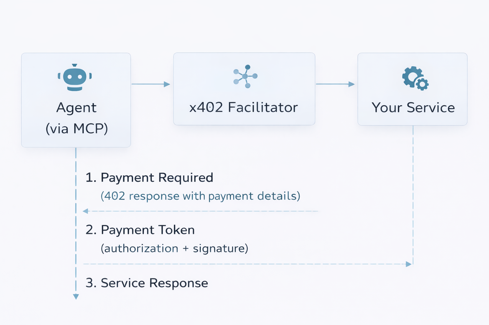

# Service Provider Guide

This guide explains how to integrate with Kite Agent Passport as a service provider. Kite fully supports the x402 payment protocol through our facilitator partners.

## What You're Building

By integrating with Kite Agent Passport, your service will be able to:

- Accept payments from AI agents on behalf of users
- Receive guaranteed, pre-authorized payments via x402 protocol
- Access the growing market of agentic applications
- Work seamlessly with any x402-compatible facilitator

## Prerequisites

Before you begin, ensure you have:

- [ ] A service that can be called via API
- [ ] Understanding of HTTP 402 Payment Required responses
- [ ] A service wallet address on Kite L1 testnet

### What You DON'T Need to Build

- **Payment infrastructure** — Kite facilitators handle on-chain execution
- **Wallet management** — End users manage their own wallets via Kite Passport
- **Session/delegation systems** — Kite Passport handles user authorizations
- **Redemption APIs** — Payments go directly to your wallet address

Your only responsibility is implementing the x402 protocol to request and verify payments.

---

## Overview: The Payment Flow




**Key Points:**
1. Your service returns a 402 Payment Required response with payment details
2. The agent (via Kite MCP tools) obtains a signed payment authorization from the user
3. Your service receives the payment token (X-Payment header) from the agent
4. You verify the payment token and call the facilitator to execute the transfer
5. The facilitator executes the on-chain transfer to your payee address
6. You deliver the service after confirming payment

### Who Pays

In the current Kite Agent Passport flow:
- **End users** have their own Kite Passports with wallet balances
- Users authorize payments through their AI agents
- Users maintain their own sessions and spending rules
- You (the service provider) receive payments directly to your wallet

This is different from other models where developers might pay on behalf of users. In the Kite ecosystem, users control their own funds.

---

## Sample Service: Weather API

To understand how to implement x402, let's look at a sample service:

**Weather Service:** https://x402.dev.gokite.ai/api/weather

Try calling it without payment:
```bash
curl https://x402.dev.gokite.ai/api/weather?location=San%20Francisco
```

**Response (402 Payment Required):**
```json
{
  "error": "X-PAYMENT header is required",
  "accepts": [{
    "scheme": "gokite-aa",
    "network": "kite-testnet",
    "maxAmountRequired": "1000000000000000000",
    "resource": "https://localhost:8099/api/weather",
    "description": "Weather API - Public endpoint with query params",
    "mimeType": "application/json",
    "outputSchema": {
      "input": {
        "discoverable": true,
        "method": "GET",
        "queryParams": {
          "location": {"description": "City name or coordinates", "required": true, "type": "string"},
          "units": {"default": "metric", "enum": ["metric", "imperial"], "type": "string"}
        },
        "type": "http"
      },
      "output": {
        "properties": {
          "conditions": {"description": "Weather conditions", "type": "string"},
          "humidity": {"description": "Humidity percentage", "type": "number"},
          "temperature": {"description": "Current temperature", "type": "number"}
        },
        "required": ["temperature", "conditions"],
        "type": "object"
      }
    },
    "payTo": "0x4A50DCA63d541372ad36E5A36F1D542d51164F19",
    "maxTimeoutSeconds": 300,
    "asset": "0x0fF5393387ad2f9f691FD6Fd28e07E3969e27e63",
    "extra": null,
    "merchantName": "Weather Service"
  }],
  "x402Version": 1
}
```

**Key Response Fields:**

| Field | Description | Example Value |
|-------|-------------|---------------|
| `scheme` | Payment scheme to use | `gokite-aa` |
| `network` | Target network | `kite-testnet` |
| `maxAmountRequired` | Maximum payment amount (in wei) | `1000000000000000000` (1 token) |
| `asset` | Token contract address | `0x0fF5393387ad2f9f691FD6Fd28e07E3969e27e63` |
| `payTo` | Your service wallet address | `0x4A50DCA63d541372ad36E5A36F1D542d51164F19` |
| `maxTimeoutSeconds` | Payment timeout | `300` |
| `merchantName` | Your service name | `Weather Service` |
| `outputSchema` | API input/output specification | (see above) |

---

## Kite Testnet Payment Token

For services to support Kite Testnet, you must use the same payment token as the weather service:

**Token Address:** `0x0fF5393387ad2f9f691FD6Fd28e07E3969e27e63`

**Token Details:** https://testnet.kitescan.ai/token/0x0fF5393387ad2f9f691FD6Fd28e07E3969e27e63

This is the testnet stablecoin (Test USDT) used for payments on Kite L1 Testnet.

---

## Kite Facilitator Support

Kite Agent Passport fully supports the x402 protocol and works with any x402-compatible facilitator. We recommend using:

### x402 Pieverse Facilitator

| Property | Value |
|----------|-------|
| **Service** | x402 Pieverse Facilitator |
| **Version** | 2.0.0 |
| **Base URL** | https://facilitator.pieverse.io |
| **Documentation** | https://facilitator.pieverse.io/ |

Kite Agent Passport payments use the **Kite chain** (Kite Testnet for testing; Kite mainnet for production). For payment facilitation with Kite, use the following:

**Kite Testnet Facilitator Address:**

```
0x12343e649e6b2b2b77649DFAb88f103c02F3C78b
```

**API Endpoints:**

| Endpoint | Method | Description |
|----------|--------|-------------|
| `/v2/verify` | POST | Verify payment signature |
| `/v2/settle` | POST | Settle payment (execute on-chain) |

The facilitator handles the on-chain execution of payments. Once a payment is authorized, the facilitator executes the `transferWithAuthorization` call and transfers funds directly to your specified payee address.

### Demo Facilitators

We provide demo facilitators to clarify what is needed to support Kite payment. These reference implementations demonstrate how to enable x402 facilitation with Kite:

**Repository:** https://github.com/gokite-ai/x402

Service providers can open their service to AI agents through these facilitators. Use these demos as a reference for understanding the facilitator requirements and integration patterns.

---

## Implementing x402 Support

Kite provides facilitator support for x402 payments. **Implementing the x402 protocol on your service is your responsibility.** This includes:

- Returning 402 Payment Required responses with the correct JSON format
- Verifying payment tokens when received from agents
- Managing your service wallet and received funds

### Step 1: Return 402 Payment Required Response

When your service receives a request without a valid payment, return a 402 status with payment details:

```json
{
  "error": "X-PAYMENT header is required",
  "accepts": [{
    "scheme": "gokite-aa",
    "network": "kite-testnet",
    "maxAmountRequired": "1000000000000000000",
    "resource": "https://your-service.com/api/endpoint",
    "description": "Your API - Description of your service",
    "mimeType": "application/json",
    "outputSchema": {
      "input": {
        "discoverable": true,
        "method": "GET",
        "queryParams": {
          "param1": {"description": "Parameter description", "required": true, "type": "string"}
        },
        "type": "http"
      },
      "output": {
        "properties": {
          "result": {"description": "Result description", "type": "string"}
        },
        "required": ["result"],
        "type": "object"
      }
    },
    "payTo": "0xYourServiceWalletAddress",
    "maxTimeoutSeconds": 300,
    "asset": "0x0fF5393387ad2f9f691FD6Fd28e07E3969e27e63",
    "extra": null,
    "merchantName": "Your Service Name"
  }],
  "x402Version": 1
}
```

### Step 2: Receive and Verify Payment Token

When the agent resends the request with the `X-PAYMENT` header, extract and verify it:

```bash
# Example request with payment
curl -H "X-PAYMENT: eyJhdXRob3JpemF0aW9uIjp7..." \
  https://your-service.com/api/endpoint
```

The `X-PAYMENT` header contains a base64-encoded JSON object with the payment authorization and signature.

### Step 3: Settle Payment via Facilitator

Call the facilitator's `/v2/settle` endpoint to execute the on-chain transfer:

```bash
curl -X POST https://facilitator.pieverse.io/v2/settle \
  -H "Content-Type: application/json" \
  -d '{
    "authorization": {...},
    "signature": "0x...",
    "network": "kite-testnet"
  }'
```

### Step 4: Deliver Your Service

After confirming payment settlement, return your service's actual response to the agent.

### Payment Settlement

Payments are executed on-chain by the facilitator directly to your payee address. Since you control this wallet address, you can transfer received tokens to any target address at any time.

### Resources for Implementation

For detailed implementation guidance on the x402 protocol, refer to:

- **x402 Protocol Specification** - https://docs.x402.org/introduction
- **Pieverse Facilitator Docs** - https://facilitator.pieverse.io/
- **x402 Reference Implementation** - https://github.com/gokite-ai/x402

---

## Next Steps

1. **Review the x402 protocol** to understand implementation requirements
2. **Set up your service wallet** on Kite L1 testnet
3. **Implement x402 support** in your service using the weather service as a reference
4. **Test with Kite Agent Passport** — See [End User Guide](end-user-guide.md) for how users will connect and pay
5. **Prepare for mainnet** by reviewing the [Testnet Notice](testnet-notice.md)

### Testing Your Integration

To test your x402 service with Kite Agent Passport:

1. Set up a test user account in the [Kite Portal](https://x402-portal-eight.vercel.app/)
2. Fund the test account with testnet tokens from the [faucet](https://faucet.gokite.ai/)
3. Create a test agent and configure MCP in an AI client (e.g., Claude Desktop)
4. Have the AI client call your service
5. Verify your service returns the correct 402 response format
6. Confirm payment is processed and your service delivers the response

For detailed testing steps from the user perspective, see the [End User Guide](end-user-guide.md).

***

*Need help? [Open an issue](https://github.com/gokite-ai/developer-docs/issues/new/choose) or contact the Kite team.*

*Continue to: [Developer Guide](developer-guide.md)*
