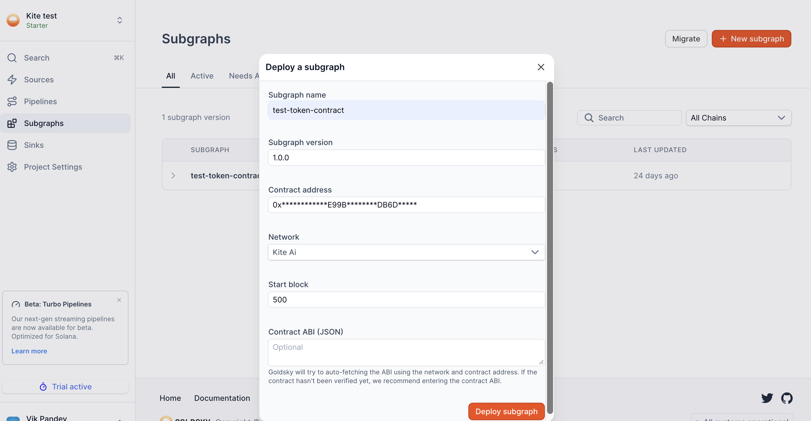

# Indexing Kite AI with Goldsky

## Overview

Goldsky provides high-performance blockchain data infrastructure for Kite AI, making it easy to extract, transform, and serve on-chain data for both production apps and analytics workloads.

For Kite AI builders, Goldsky is the recommended indexing layer for:

* dApps and dashboards
* Agent analytics and observability
* Protocol monitoring and data pipelines
* Real-time and historical on-chain queries

Goldsky supports two primary data access models:

* **Subgraphs** – High-performance, GraphQL-based indexing
* **Mirror** – Real-time replication pipelines into databases and warehouses

## Documentation Index

Before diving deeper, you can fetch Goldsky's full documentation index here:

https://docs.goldsky.com/chains/kite-ai#indexing-kite-ai-with-goldsky

This index lists all available pages, guides, and references, and is useful for discovering advanced features before implementing a specific flow.

## Getting Started

To index Kite AI with Goldsky, you'll need to:

1. Create a Goldsky account
2. Install the Goldsky CLI
3. Authenticate using an API key

Note - Using Goldsky from the UI is as simple as clicking "+ New subgraph" to get started:



### Install the Goldsky CLI & Log In

**For macOS/Linux:**

```bash
curl https://goldsky.com | sh
```

**For Windows:**

```bash
npm install -g @goldskycom/cli
```

### Create an API Key

1. Go to Project Settings in the Goldsky dashboard
2. Generate a new API key for your project

### Authenticate via CLI

```bash
goldsky login
```

### Verify Installation

```bash
goldsky
```

## Indexing Kite AI with Subgraphs

Subgraphs are the most common way to index Kite AI contracts and events.

Goldsky supports two deployment paths, depending on how much control you need.

### Option 1: Deploy a Custom Subgraph (Full Control)

Use this option if you want:

* Custom schemas
* Derived entities
* Complex mappings or transformations

**Requirements:**

* `subgraph.yaml`
* `schema.graphql`
* Mapping files (AssemblyScript)

**Deploy command:**

```bash
goldsky subgraph deploy <name>/<version> --path .
```

### Option 2: Instant Subgraphs (Quick Start)

Use instant subgraphs if you want:

* Fast setup
* Minimal configuration
* Event-level indexing from an ABI

You only need:

* Contract address
* ABI file

**Deploy command:**

```bash
goldsky subgraph deploy <name>/<version> \
  --from-abi <ABI_PATH> \
  --network <CHAIN_SLUG>
```

Goldsky automatically generates:

* `subgraph.yaml`
* Schema
* Event mappings

## Kite AI Network Configuration

Use the following chain slugs when deploying subgraphs for Kite AI:

| Network | Chain Slug |
|---------|------------|
| Kite AI Mainnet | `kite-ai` |
| Kite AI Testnet | `kite-ai-testnet` |

These slugs are required for:

* Subgraph deployments
* Instant subgraphs
* Mirror pipelines

## Common Kite AI Use Cases

Builders commonly use Goldsky on Kite AI for:

* Agent payment flows & settlement tracking
* ERC-20 / native token analytics
* Protocol-level metrics (TPS, volume, usage)
* Explorer backends & dashboards
* Agent reputation, activity, and lifecycle analytics

Goldsky pairs especially well with agent-native apps that require:

* Low-latency reads
* Deterministic historical queries
* Scalable analytics without running infra

## Getting Support

If you run into issues or need help with advanced setups:

**Goldsky Support:** support@goldsky.com
